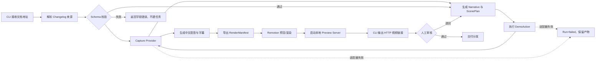

# 产品架构：运行

## 单次任务流水线

## 状态与恢复

- `validated`：release brief 已通过校验。
- `planning` / `capturing` / `rendering`：阶段进行中；具体枚举以核心实现为准，现为 `inferred`。
- `pending_review`：已输出带中文配音与字幕的视频，等待运营团队人工审核。
- `approved` / `changes_requested`：记录人工审核决定；退回后复用原 run 产物进行修订，修订策略为 `pending`。
- `completed`：仅用于技术流水线已成功完成；业务交付须以 `approved` 为准。

## 时长策略

每条视频包括 10–15 秒开场/结尾，每项 feature 分配 12–20 秒；预估超过 90 秒时，按 feature 边界拆成系列。具体采用上下限、开场/结尾秒数与拆分命名由实现配置化。[S-004]

## 首发样本

`v0.3.3` Changelog 解析为四组候选镜头：感知与 IM 路由、企业微信办公能力、Agent 与任务协作、验证。首条视频优先聚焦“感知与 IM 路由”。Code Evidence Explorer 必须从相关 commit/diff 找到产品入口和可观察结果；证据不足的条目使用旁白或交给人工补充，不能虚构操作路径。[S-005, S-006]
- `failed`：记录阶段、错误和已完成产物；可由未来的重试控制器恢复，`pending`。
